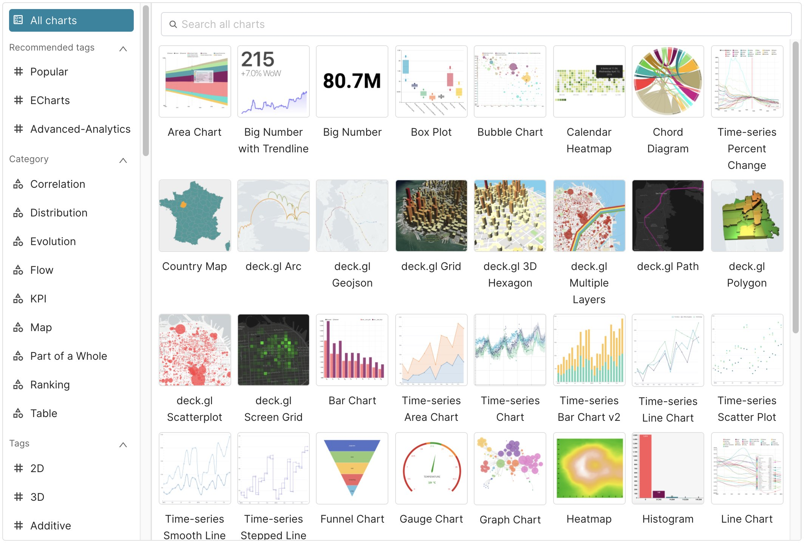
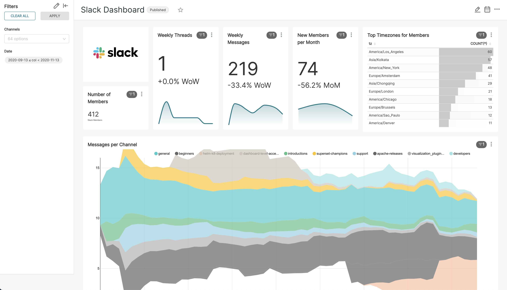
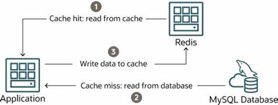
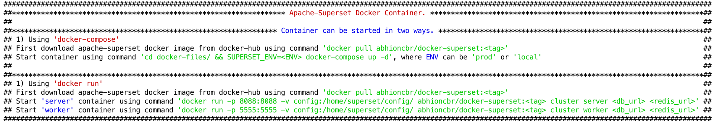

# contributors
Kousseila OUAGUENI <https://www.linkedin.com/in/kousseila-ouagueni/>

# docker superset
Repository for building [Docker](https://www.docker.com/) container of [Apache Superset](https://superst.apache.org) &[github superset ](https://github.com/apache/superset/).[docker-compose](https://superset.apache.org/docs/installation/installing-superset-using-docker-compose/)

[](https://superset.apache.org/)


Superset is a modern data exploration and data visualization platform. Superset can replace or augment proprietary business intelligence tools for many teams. Superset integrates well with a variety of data sources.

# Superset provides:

* A no-code interface for building charts quickly
* A powerful, web-based SQL Editor for advanced querying
* A lightweight semantic layer for quickly defining custom dimensions and metrics
* Out of the box support for nearly any SQL database or data engine
* A wide array of beautiful visualizations to showcase your data, ranging from simple bar charts to geospatial visualizations
* Lightweight, configurable caching layer to help ease database load
* Highly extensible security roles and authentication options
* An API for programmatic customization
* A cloud-native architecture designed from the ground up for scale

# Screenshots & Gifs
Large Gallery of Visualizations

   [](gallery.jpg) 

# Craft Beautiful, Dynamic Dashboards

   [](slack_dash.jpg)
# Project of docker-superset-mysql with redis db

Apache-superset  using Mysql DB and data from redis
* The objectif of my project to use the solution of busness intelligence from Apache-seperset (data visualization platform) using Redis and Mysql(add mysql workbench).
Redis : is a fast open*source in memory data structure store, offring a set of versatile in memory data structures that allow as to easily build a wid range of custom applications.

* the data transfer structure :


   [](structure.jpg)  


# Git FLOW 

I used the git flow for this project. The structure of our repository is the following : 
2 branchs and the remote 'master' as dev version and  an 'main'


## How to run using docker commands
* Through general docker commands -
    * first pull a docker  superset image from [docker-hub](https://hub.docker.com/repository/docker/kousseila/superset-mysql/) using either
        ```shell
        docker pull kousseila/superset-mysql :
        ```    
      or for specific superset version by providing version value    
        ```shell
        docker pull kousseila/superset-mysql:<version-tag>
        ```   
    
    * Copy [superset_config.py](config/superset_config.py), [docker-compose.yml](docker-files/docker-compose.yml), and [.env](docker-files/.env) files. I am considering directory structure like below
        ```
        docker-superset-mysql
             |_ config
             |    |_superset_config.py
             |
             |_docker-files
             |    |_docker-compose.yml
             |    |_.env
             |    |_Dockerfile
        
        ```   

    * using `docker-compose`:
        * starting a superset image as a `superset` container in a **local** mode:
            ```shell
            cd docker-superset-mysql/docker-files/ && docker-compose up -d
            
            * Go to the floder where the file docker-compose.yml
            
              docker-compose -f docker-compose.yml up -d                   ```

          or for passing some different environment variables values like below
            ```shell
            cd docker-superset-mysql /docker-files/ && SUPERSET_ENV=local SUPERSET_VERSION=<version-tag> docker-compose up -d
            ```           
        
        * starting a superset image as a `superset` container in a **prod** mode:
            ```shell
            cd docker-superset-mysql/docker-files/ && SUPERSET_ENV=prod SUPERSET_VERSION=<version-tag> docker-compose up -d
            ```
            
    * using `docker run`:    
        * starting a superset image as a `server` container:
            ```shell
            cd docker-superset-mysql && docker run -p 8088:8088 -v config:/home/superset/config/ kousseila/superset-mysql:<version-tag> cluster server <superset_metadata_db_url> <redis_url>
            ```        
        * starting a superset image as a `worker` container:
            ```shell
             cd docker-superset-mysql && docker run -p 5555:5555 -v config:/home/superset/config/ kousseila/superset-mysql:<version-tag> cluster worker <superset_metadata_db_url> <redis_url>
            ```    
       
    [](docker-superset_execution.png)   
         
   
   
   
>>>>>>> 987c2c9 (Mise à jour le 27 décembre 2022)
